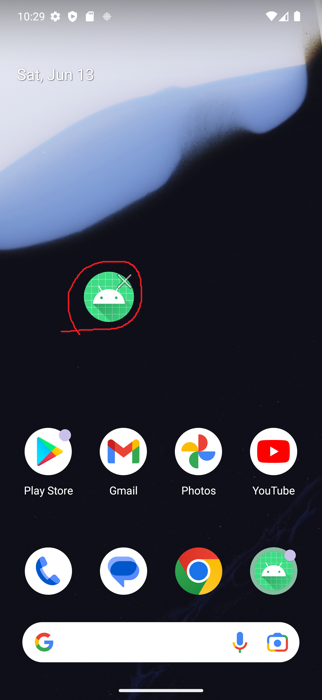

# AndKot-FloatingIconSample(SYSTEM_ALERT_WINDOW version)
Sample for Floating Icon Android (Kotlin).
※It seems difficult to publish apps that use SYSTEM_ALERT_WINDOW permission to the Play Store.

[Screen_recording.webm](https://github.com/user-attachments/assets/8ac2aea6-7688-499f-b6fe-98ff6eec7b0b)

# For more details, check out this blog.
- en: In progress
- 日本語: [Floating Iconのサンプル](https://zenn.dev/rg687076/articles/3ef62fe96f7e05)
